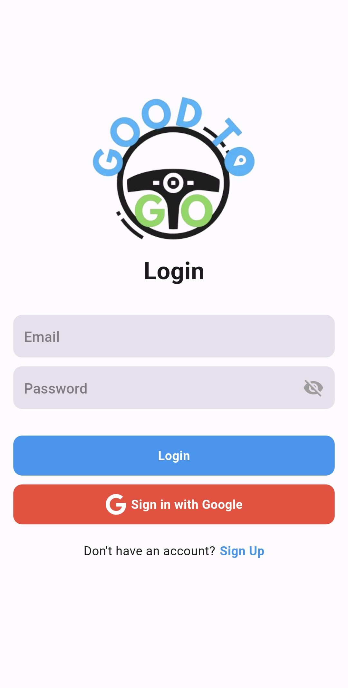
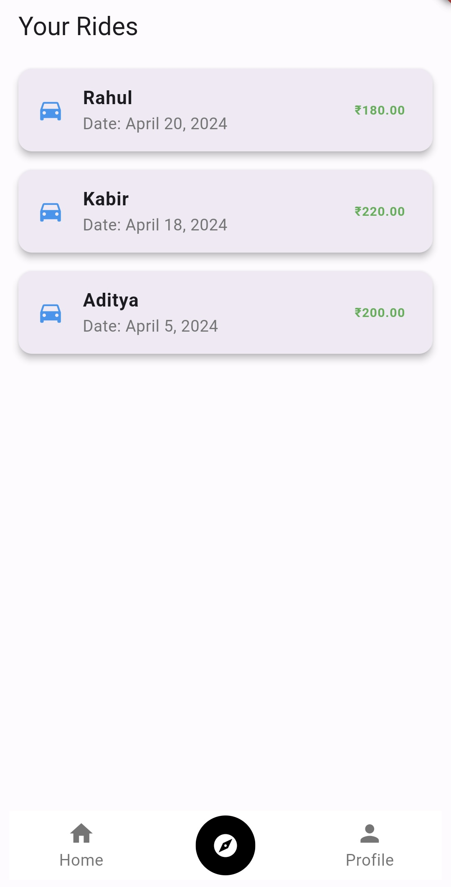
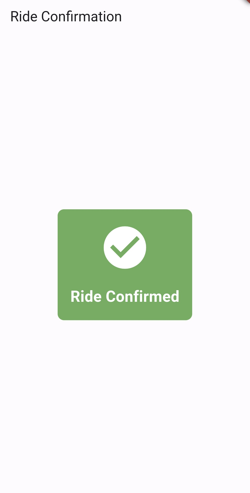
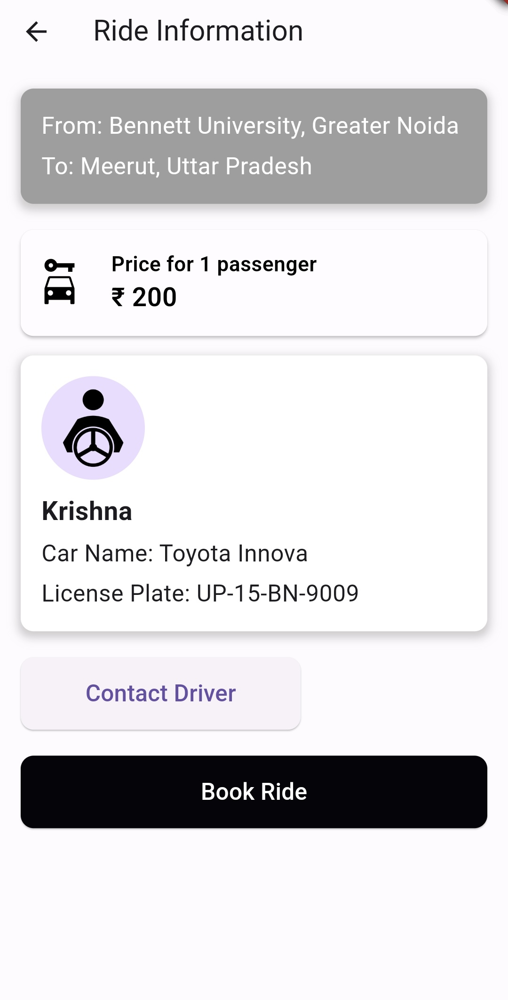
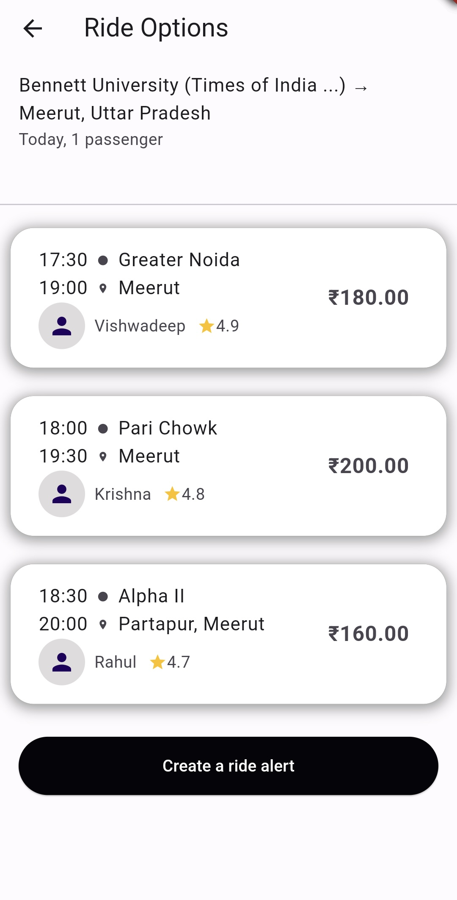
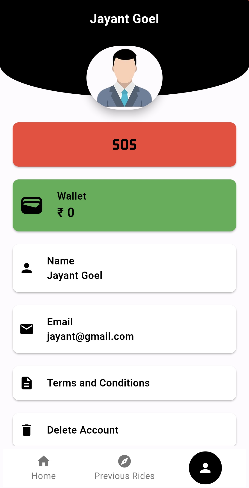

# 🚗 Good to Go — Flutter Carpooling App


> A modern carpooling application built with **Flutter** and **Firebase**, enabling users to easily share rides, reduce travel costs, and promote sustainable commuting.

---

## 🌟 Features

- 🚘 **Ride Sharing** — Create or join rides with other verified users.  
- 🔒 **Secure Authentication** — Email & Google login using Firebase Auth.   
- 🌐 **Cloud Data Sync** — Firebase Firestore ensures instant updates.  
- 🪄 **Clean & Modern UI** — Built with Material 3 and Flutter animations.  

---

## 🖼️ App Screenshots

## 🖼️ App Screenshots

| Login | Rides | Confirmation | Ride Details | Options | Search | Profile |
|:------:|:------:|:--------------:|:--------------:|:--------:|:--------:|:--------:|
|  |  |  |  |  |  |  |


---

## 🧠 Architecture Overview

> The app follows a **modular MVC structure** and uses Firebase as backend for authentication, data storage, and real-time updates.

---

## ⚙️ Installation & Setup

Follow these steps to run the app locally:

```bash
# Clone the repository
git clone https://github.com/Jayantgoel07/Good-to-Go.git

# Navigate to project folder
cd Good-to-Go

# Install dependencies
flutter pub get

# Run the app
flutter run
```

### 🔑 Firebase Configuration
1. Create a Firebase project at [Firebase Console](https://console.firebase.google.com/).  
2. Enable **Authentication**, **Cloud Firestore**, and **Storage**.  
3. Add your `google-services.json` (Android) and/or `GoogleService-Info.plist` (iOS).  
4. Run the app again.

---

## 🧩 Tech Stack

| Category | Technologies |
|-----------|--------------|
| Framework | Flutter (Dart) |
| Backend | Firebase Auth, Firestore, Storage |
| State Management | Provider / Riverpod |
| UI | Material Design 3 |
| Others | Lottie Animations, Geolocator, Image Picker |

---

## 🚀 Future Enhancements

- 📍 Live tracking of ride progress  
- ⭐ User ratings & reviews  
- 🧾 Payment integration  
- 🌙 Dark mode  
- 🔔 Push notifications  

---

## 🤝 Contributing

Contributions are welcome!  
1. Fork the repo  
2. Create your feature branch: `git checkout -b feature-name`  
3. Commit your changes: `git commit -m 'Add new feature'`  
4. Push to the branch: `git push origin feature-name`  
5. Create a Pull Request  

---

## 🧑‍💻 Author

**👋 Jayant Goel**  
💼 Flutter Developer | 🚀 Tech Enthusiast | 🧠 Learner  

[](https://github.com/JayantGoel07)
[](https://linkedin.com/in/jayantgoel07)
[](https://x.com/jayantgoel07)

---

> _“We are now - Good to Go”_
